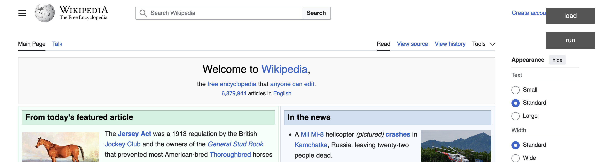

# MainLine

`Load` and `Run` buttons to execute code on any site.

# How to Use

1. Copy the string from `out.txt`.

2. Create a random bookmark in your bookmarks toolbar.

3. Edit the bookmark and replace the URL with the text copied from Step 1.

4. Navigate to a website.

5. Click the bookmark to make the `Load` and `Run` button appear.

6. Click `load` and select a JS file that contains a function called `main`. (See `example_main.js`)

7. Click `run` and the `main` function will be run with access to the current HTML document.

# Screenshot

This is a screenshot from Wikipedia after clicking the bookmarklet. A `load` and `run` button is shown allowing the user to `load` a main function and run this function on the current page.

# Future Development

- [ ] Add any number of functions to the file (in addition to main) and give the user a list of buttons allowing them to trigger any function from the file.
      - The idea is they could have one file for each site that presents them with a list of buttons that they regularly use.
